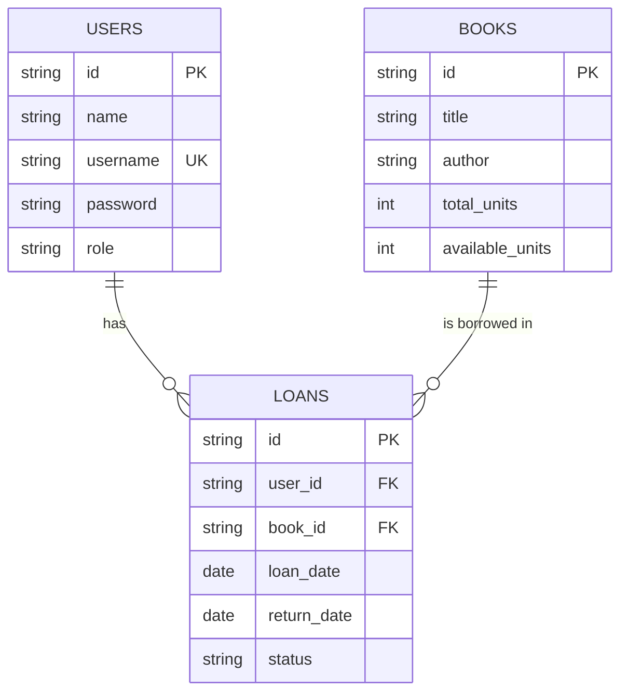

# DOSW-Library

Este proyecto implementa una API de biblioteca con Spring Boot para gestionar:

- Libros
- Usuarios
- Préstamos
- Disponibilidad de ejemplares
- Manejo centralizado de errores
- Pruebas unitarias con JUnit
- Reporte de cobertura con JaCoCo

La intención de este README es explicarte TODO el proceso paso a paso, desde la idea hasta la ejecución, para que entiendas el tema a profundidad.

## 1) ¿Qué problema resuelve el proyecto?

Una biblioteca necesita responder estas preguntas de negocio:

- ¿Qué libros existen?
- ¿Cuántos ejemplares hay de cada libro?
- ¿Un libro está disponible o no?
- ¿Qué usuarios están registrados?
- ¿Quién tiene un libro prestado?
- ¿Cuándo se prestó y cuándo se devolvió?
- ¿Qué errores deben devolverse si algo sale mal?

Para resolver eso, el sistema implementa reglas claras:

- No se puede prestar un libro sin stock.
- No se puede prestar si el usuario no existe.
- Un usuario tiene límite de préstamos activos.
- Al devolver un libro, el stock aumenta.

## 2) Estructura del proyecto (arquitectura por capas)

Se organizó el código en paquetes dentro de `edu.eci.dosw.tdd`:

- `controller`: endpoints HTTP (lo que expone la API)
- `controller/dto`: objetos de entrada/salida de la API
- `controller/mapper`: conversión entre DTO y modelo de negocio
- `core/model`: entidades del dominio (Book, User, Loan, Status)
- `core/service`: lógica de negocio
- `core/validator`: validaciones
- `core/util`: utilidades compartidas
- `core/exception`: excepciones de negocio

Esto permite separar responsabilidades y mantener un código más limpio:

- Controller: recibe requests y devuelve responses.
- Service: toma decisiones de negocio.
- Model: representa datos del dominio.
- Validator/Exception: asegura reglas y errores claros.

## 3) Modelos del dominio

Se definieron 4 piezas principales:

### Book

Representa un libro con:

- `id`
- `title`
- `author`

### User

Representa un usuario con:

- `id`
- `name`

### Loan

Representa un préstamo con:

- `id`
- `book`
- `user`
- `loanDate`
- `returnDate`
- `status`

### Status

Enum de estado del préstamo:

- `ACTIVE`
- `RETURNED`

## 4) Cómo se guardan los datos en memoria

Este proyecto no usa base de datos (todavía). Todo está en memoria dentro de servicios.

### En `BookService`

- `Map<String, Book> books`: catálogo de libros por id.
- `Map<String, Integer> stockByBookId`: cantidad de ejemplares por libro.

Esto cumple exactamente con el requisito de “mapa de libros (libro + cantidad de ejemplares)”.

### En `UserService`

- `List<User> users`: listado de usuarios registrados.

### En `LoanService`

- `List<Loan> loans`: listado de préstamos.

## 5) Reglas de negocio implementadas

### Libros

- Agregar libro con cantidad.
- Listar todos los libros.
- Consultar libro por id.
- Consultar disponibilidad por stock (`quantity > 0`).
- Forzar disponibilidad (`PATCH /availability`):
- Si se pone `false`, stock queda en 0.
- Si se pone `true` y estaba en 0, se deja en 1.

### Usuarios

- Registrar usuario.
- Listar usuarios.
- Consultar usuario por id.

### Préstamos

- Crear préstamo validando:
- Usuario existente.
- Libro existente.
- Libro con stock.
- Límite de préstamos activos por usuario (3).
- Devolver préstamo:
- Cambia estado a `RETURNED`.
- Coloca `returnDate`.
- Sube el stock del libro.

## 6) Manejo global de errores (Error Handler)

Se implementó `GlobalExceptionHandler` con `@RestControllerAdvice`.

¿Qué logra esto?

- Evita errores desordenados en texto plano.
- Devuelve respuestas consistentes para el cliente.
- Centraliza el manejo de excepciones de negocio.

Formato de error con `ApiError`:

- `timestamp`
- `status`
- `error`
- `message`

Errores manejados:

- `BookNotAvailableException` → `409 CONFLICT`
- `UserNotFoundException` → `404 NOT_FOUND`
- `LoanLimitExceededException` → `400 BAD_REQUEST`
- `IllegalArgumentException` → `400 BAD_REQUEST`

## 7) Endpoints expuestos

### Books

- `POST /books` crea libro.
- `GET /books` lista libros.
- `GET /books/{bookId}` obtiene libro por id.
- `PATCH /books/{bookId}/availability?available=true|false` actualiza disponibilidad.

Ejemplo `POST /books`:

```json
{
	"title": "Clean Code",
	"author": "Robert C. Martin",
	"quantity": 3
}
```

### Users

- `POST /users` registra usuario.
- `GET /users` lista usuarios.
- `GET /users/{userId}` obtiene usuario por id.

Ejemplo `POST /users`:

```json
{
	"name": "Maria"
}
```

### Loans

- `POST /loans` crea préstamo.
- `POST /loans/{loanId}/return` devuelve préstamo.
- `GET /loans` lista préstamos.

Ejemplo `POST /loans`:

```json
{
	"userId": "USER_ID",
	"bookId": "BOOK_ID"
}
```

## 8) Flujo completo explicado paso a paso

### Escenario feliz (préstamo correcto)

1. Registras usuario con `POST /users`.
2. Creas libro con stock con `POST /books`.
3. Llamas `POST /loans` con `userId` + `bookId`.
4. El sistema valida existencia de usuario/libro.
5. El sistema valida límite de préstamos.
6. El sistema baja stock del libro.
7. Crea un `Loan` con estado `ACTIVE` y fecha actual.
8. Devuelve el préstamo creado.

### Escenario de devolución

1. Llamas `POST /loans/{loanId}/return`.
2. El sistema busca ese préstamo.
3. Si ya estaba devuelto, responde error.
4. Si estaba activo, cambia a `RETURNED`.
5. Coloca fecha de devolución.
6. Incrementa stock del libro.

### Escenario de error por stock

1. Un libro ya no tiene ejemplares (`stock = 0`).
2. Se intenta crear otro préstamo de ese libro.
3. Se lanza `BookNotAvailableException`.
4. `GlobalExceptionHandler` devuelve `409` con mensaje claro.

## 9) Pruebas implementadas

Se crearon pruebas unitarias de servicios para cubrir éxitos y errores:

- `BookServiceTest`
- `UserServiceTest`
- `LoanServiceTest`

Escenarios cubiertos:

- Crear y consultar libro.
- Cambiar disponibilidad.
- Error al buscar libro inexistente.
- Registrar y consultar usuario.
- Error por usuario inexistente.
- Crear y devolver préstamo.
- Error por libro sin stock.
- Error por límite de préstamos activos.

## 10) Cobertura y análisis

### Cobertura (JaCoCo)

Se genera en:

- `target/site/jacoco/index.html`

Comando:

```bash
mvn verify
```

### Análisis estático (Sonar)

Configura estas variables de entorno antes de ejecutar el análisis:

```powershell
$env:SONAR_TOKEN="tu_token"
$env:SONAR_ORGANIZATION="tu_organizacion"
$env:SONAR_PROJECT_KEY="tu_project_key"
```

Comando:

```bash
mvn -DskipTests sonar:sonar -Dsonar.organization=tu_organizacion -Dsonar.projectKey=tu_project_key
```

Nota importante: para que funcione, debes tener configurado en SonarCloud:

- organización existente
- project key correcto
- token válido en `SONAR_TOKEN`

## 11) Cómo ejecutar localmente

### 1. Compilar

```bash
mvn -DskipTests compile
```

### 2. Ejecutar pruebas

```bash
mvn test
```

### 3. Levantar API

```bash
mvn spring-boot:run
```

## 12) Decisiones técnicas importantes (para entender el “por qué”)

- Se usó almacenamiento en memoria para enfocarse en lógica de negocio.
- Se separó DTO del modelo para no acoplar contrato HTTP al dominio.
- Se centralizó manejo de errores para respuestas consistentes.
- Se añadió validación explícita para evitar datos inválidos.
- Se implementaron pruebas primero sobre servicios porque ahí vive la lógica crítica.

## 13) Qué sigue para evolucionar el proyecto

Cuando este nivel esté dominado, el siguiente paso natural es:

- Persistencia real con JPA + PostgreSQL
- Capa repository
- Más pruebas de integración con `@SpringBootTest` y `MockMvc`
- Versionado de API y documentación con OpenAPI/Swagger
- Endurecer reglas de negocio (fechas límite, multas, etc.)

---

Si estás estudiando este proyecto para clase, te recomiendo practicar en este orden:

1. Crear usuario.
2. Crear libro con distintas cantidades.
3. Prestar hasta agotar stock.
4. Forzar errores (usuario inexistente, límite de préstamos).
5. Devolver préstamo y comprobar que el stock sube.
6. Revisar los tests y luego escribir uno nuevo por tu cuenta.

Ese ejercicio te deja dominando el flujo completo de una API de negocio real.

## 14) Parte 1 - Persistencia relacional (paso a paso)

### Paso 1. Modelo relacional en 3FN

Se normalizo el dominio en 3 tablas principales: `books`, `users` y `loans`.

- Cada libro mantiene inventario (`total_units`, `available_units`).
- Cada prestamo referencia exactamente 1 usuario y 1 libro.
- El estado del prestamo se maneja con enum (`ACTIVE`, `RETURNED`).
- El usuario maneja rol para evolucionar hacia autorizacion (`USER`, `LIBRARIAN`).

Diagrama ER (3FN):



### Paso 2. Nueva capa persistence

Se agrego la capa `persistence` al mismo nivel de `controller` y `core`, con:

- `persistence/entity`: entidades JPA.
- `persistence/repository`: interfaces Spring Data JPA.
- `persistence/mapper`: mappers entre entidad y modelo de dominio.

### Paso 3. Dependencias para persistencia

Se agregaron a `pom.xml`:

- Spring Data JPA
- Driver PostgreSQL
- H2 para pruebas

### Paso 4. Entidades DAO/JPA

Entidades creadas:

- `BookEntity`
- `UserEntity`
- `LoanEntity`

Con relaciones:

- `LoanEntity` -> `UserEntity` (`@ManyToOne`)
- `LoanEntity` -> `BookEntity` (`@ManyToOne`)

### Paso 5. Repositorios

Se crearon:

- `BookRepository`
- `UserRepository`
- `LoanRepository`

Incluyendo consultas derivadas para reglas de negocio (por ejemplo, conteo de prestamos activos por usuario).

### Paso 6. Configuracion PostgreSQL en YAML

Archivo: `src/main/resources/application.yaml`

Variables usadas:

- `DB_HOST` (default `localhost`)
- `DB_PORT` (default `5432`)
- `DB_NAME` (default `dosw_library`)
- `DB_USER` (default `postgres`)
- `DB_PASSWORD` (default `postgres`)

### Paso 7. Servicios migrados de memoria a BD

Se eliminaron estructuras en memoria y se inyectaron repositorios en:

- `BookService`
- `UserService`
- `LoanService`

### Paso 8. Escaneo JPA

No fue necesario `@EnableJpaRepositories` porque los paquetes estan bajo el root package de la aplicacion y Spring Boot los detecta automaticamente.

### Paso 9. Pruebas funcionales con persistencia

Se migraron pruebas de servicios a `@SpringBootTest` con perfil `test` y H2 en memoria:

- `BookServiceTest`
- `UserServiceTest`
- `LoanServiceTest`
- `DoswLibraryApplicationTests`

Comando ejecutado:

```bash
mvn test
```

Resultado actual: **9 tests OK, 0 failures, 0 errors**.

### Paso 10. Video

Pendiente manual: grabar video de evidencias y agregar enlace en este README.

## 15) Bitácora cronológica completa (TODO explicado en orden)

Esta sección explica, en orden real de ejecución, cada cambio importante aplicado al proyecto:

- Qué se cambió
- Dónde se cambió (archivo y capa)
- Por qué se cambió
- Qué efecto tuvo en el sistema
- Qué problema apareció durante la implementación y cómo se corrigió

### Fase 0. Estado inicial del proyecto

Antes de la evolución, el sistema estaba así:

- Arquitectura por capas con `controller`, `core/model`, `core/service`, `core/validator`.
- Persistencia en memoria:
	- `BookService` guardaba datos en `Map`.
	- `UserService` guardaba datos en `List`.
	- `LoanService` guardaba datos en `List`.
- No había persistencia relacional real.
- No existían entidades JPA ni repositorios Spring Data.
- Había documentación básica y pruebas de servicio orientadas a memoria.

Objetivo de la evolución: pasar de memoria a base de datos relacional, preparar modelo de inventario y dejar la base lista para seguridad por roles/JWT.

### Fase 1. Saneamiento de estructura y dependencias

#### 1.1 Eliminación de duplicados de modelo

Qué se hizo:

- Se eliminaron clases duplicadas antiguas del paquete `edu.eci.dosw.tdd.model`.

Por qué:

- Existían dos fuentes de verdad para entidades (`tdd.model` y `tdd.core.model`), lo cual genera ambigüedad y errores futuros.

Resultado:

- Se dejó como modelo oficial solamente `tdd.core.model`.

#### 1.2 Limpieza de Lombok repetido en Maven

Qué se hizo:

- Se consolidó Lombok a una sola dependencia en `pom.xml`.

Por qué:

- Había entradas duplicadas con versiones distintas, lo que producía warnings y riesgo de comportamiento inconsistente.

Resultado:

- POM más limpio y determinista.

### Fase 2. Documentación de API y reducción de boilerplate

#### 2.1 Swagger/OpenAPI

Qué se hizo:

- Se agregó dependencia `springdoc-openapi-starter-webmvc-ui` en `pom.xml`.
- Se agregó metadata global con `@OpenAPIDefinition` en `DoswLibraryApplication`.
- Se documentaron endpoints en controladores con `@Tag` y `@Operation`:
	- `BookController`
	- `UserController`
	- `LoanController`

Por qué:

- El ejercicio exige documentación de APIs y mejora de trazabilidad funcional.

Resultado:

- API navegable y documentada de forma estándar.

#### 2.2 Uso real de Lombok

Qué se hizo:

- Se migraron clases con getters/setters manuales a `@Data`:
	- `core/model`: `Book`, `User`, `Loan`
	- `controller/dto`: `BookDTO`, `UserDTO`, `LoanDTO`

Por qué:

- Reducir código repetitivo y facilitar evolución rápida del dominio.

Resultado:

- Código más corto y enfocado en lógica de negocio.

### Fase 3. Preparación de Parte 1 de persistencia relacional

#### 3.1 Evolución del modelo de dominio para nuevas reglas

Qué se hizo:

- En `Book` se reemplazó la lógica implícita de disponibilidad por inventario explícito:
	- `totalUnits`
	- `availableUnits`
- En `User` se agregaron credenciales y rol:
	- `username`
	- `password`
	- `role`
- Se creó `UserRole` enum (`USER`, `LIBRARIAN`).

Por qué:

- El enunciado requiere:
	- inventario real (no solo “disponible sí/no”)
	- usuario con credenciales
	- preparación para autorización por rol

Resultado:

- Dominio alineado con la especificación nueva.

#### 3.2 Evolución de DTOs y mappers de controller

Qué se hizo:

- `BookDTO` cambió de `quantity` a:
	- `totalUnits`
	- `availableUnits`
	- `available`
- `UserDTO` incorporó:
	- `username`
	- `password`
	- `role`
- `BookMapper` y `UserMapper` se ajustaron a la nueva estructura.

Por qué:

- Mantener contrato HTTP coherente con nuevo dominio.

Resultado:

- API y modelo interno dejaron de estar desalineados.

### Fase 4. Nueva capa persistence

Se creó `src/main/java/edu/eci/dosw/tdd/persistence` con tres subcapas.

#### 4.1 Entidades JPA (`persistence/entity`)

Archivos creados:

- `BookEntity`
- `UserEntity`
- `LoanEntity`

Decisiones de diseño:

- IDs tipo `String` para mantener compatibilidad con lógica existente.
- `LoanEntity` usa relaciones `@ManyToOne` hacia libro y usuario.
- `UserEntity.username` se marcó `unique`.
- Inventario persistido en columnas `total_units`, `available_units`.

#### 4.2 Repositorios (`persistence/repository`)

Archivos creados:

- `BookRepository extends JpaRepository<BookEntity, String>`
- `UserRepository extends JpaRepository<UserEntity, String>`
- `LoanRepository extends JpaRepository<LoanEntity, String>`

Consultas derivadas relevantes:

- `UserRepository.existsByUsername(...)`
- `LoanRepository.countByUserIdAndStatus(...)`
- `LoanRepository.findByUserId(...)`

#### 4.3 Mapeo entre entidades y dominio (`persistence/mapper`)

Archivos creados:

- `BookPersistenceMapper`
- `UserPersistenceMapper`
- `LoanPersistenceMapper`

Nota importante de implementación:

- Inicialmente se intentó usar generación de implementaciones con MapStruct.
- En este entorno, no se generaron beans automáticamente.
- Para garantizar funcionamiento estable inmediato, los mappers quedaron como `@Component` manuales (mapeo explícito campo a campo).

Resultado:

- El sistema tiene mapeo claro y trazable entre capa dominio y capa persistencia.

### Fase 5. Configuración de infraestructura (Maven + BD)

#### 5.1 Dependencias agregadas en `pom.xml`

- `spring-boot-starter-data-jpa`
- `postgresql` (runtime)
- `h2` (test)
- `mapstruct` + procesador (preparación para mapeo)
- `lombok-mapstruct-binding`

#### 5.2 Ajustes de compilación

- Se configuró `maven-compiler-plugin` con annotation processors.
- Se actualizó Lombok a versión compatible con el JDK local para evitar fallos de compilación.

#### 5.3 Configuración de datasource

Se creó `src/main/resources/application.yaml` con PostgreSQL parametrizado por variables de entorno:

- `DB_HOST`, `DB_PORT`, `DB_NAME`, `DB_USER`, `DB_PASSWORD`

Se creó `src/test/resources/application-test.yaml` con H2 en memoria para pruebas.

Se eliminó `application.properties` anterior (quedó reemplazado por YAML).

### Fase 6. Migración de servicios: de memoria a BD

#### 6.1 `BookService`

Cambio principal:

- Se eliminaron `Map` en memoria y se inyectó `BookRepository`.

Lógica clave adaptada:

- `addBook` guarda en BD.
- `getAllBooks/getBookById` consultan BD.
- `decreaseStock` y `increaseStock` actualizan `availableUnits` persistido.
- `increaseStock` no permite superar `totalUnits`.
- `updateAvailability(false)` fuerza `availableUnits = 0`.

#### 6.2 `UserService`

Cambio principal:

- Se eliminó `List<User>` en memoria y se inyectó `UserRepository`.

Lógica clave adaptada:

- Validación de unicidad de username vía BD.
- Asignación de rol por defecto `USER`.
- Registro, consulta por id y listado usando JPA.

#### 6.3 `LoanService`

Cambio principal:

- Se eliminó `List<Loan>` en memoria y se inyectó `LoanRepository`.

Lógica clave adaptada:

- Conteo de préstamos activos por usuario desde BD.
- Creación de préstamo persistida.
- Devolución persistida con actualización de inventario.
- Nuevo método de consulta por usuario (`getLoansByUserId`) para preparar reglas futuras.

### Fase 7. Validaciones de negocio reforzadas

#### 7.1 `BookValidator`

Se agregaron reglas de inventario:

- `totalUnits > 0`
- `availableUnits >= 0`
- `availableUnits <= totalUnits`

#### 7.2 `UserValidator`

Se agregaron reglas de credenciales:

- `username` obligatorio
- `password` obligatorio

### Fase 8. Ajustes en controladores tras cambio de inventario

#### 8.1 `BookController`

Se ajustó para nuevo contrato:

- Ya no recibe/usa `quantity`.
- Trabaja con `BookDTO` basado en inventario.
- Usa `BookMapper.toDto(book)` sin recalcular desde estructuras en memoria.

### Fase 9. Pruebas funcionales con persistencia real

#### 9.1 Migración de tests a contexto Spring + H2

Se actualizó:

- `DoswLibraryApplicationTests`
- `BookServiceTest`
- `UserServiceTest`
- `LoanServiceTest`

Cambios aplicados:

- `@SpringBootTest`
- `@ActiveProfiles("test")`
- limpieza de datos entre pruebas con repositorios
- escenarios adaptados a nuevo modelo:
	- inventario (`totalUnits/availableUnits`)
	- credenciales (`username/password`)

Resultado validado:

- `mvn test` en verde.
- 9 pruebas ejecutadas, 0 fallos, 0 errores.

### Fase 10. Problemas encontrados durante la implementación y solución

#### Problema A: incompatibilidad de Lombok con JDK local

- Síntoma: error de compilación en fase de annotation processing.
- Causa: versión de Lombok no compatible con JDK usado localmente.
- Solución: actualización de versión de Lombok en `pom.xml`.

#### Problema B: fallo de arranque por anotaciones de escaneo JPA

- Síntoma: error de compilación/imports por anotaciones de escaneo.
- Causa: anotaciones agregadas no eran necesarias en esta estructura de paquetes.
- Solución: eliminar anotaciones extra y usar autodetección estándar de Spring Boot.

#### Problema C: beans de MapStruct no generados

- Síntoma: `No qualifying bean ... PersistenceMapper` al iniciar contexto.
- Causa: no se generaron implementaciones en `target/generated-sources/annotations` en este entorno.
- Solución: mappers de persistencia implementados manualmente como `@Component`.

### Fase 11. Estado final exacto después de la evolución

Ya implementado y funcionando:

- Persistencia relacional real (JPA + repositorios + entidades + H2 para test + PostgreSQL para runtime).
- Inventario de libros con unidades totales y disponibles.
- Usuario con credenciales y rol (`USER`, `LIBRARIAN`) en dominio y persistencia.
- Controladores adaptados al nuevo contrato.
- Validaciones alineadas con reglas nuevas.
- Pruebas funcionales ejecutadas exitosamente sobre contexto con persistencia.

Pendiente de la Parte 1 (manual):

- Grabar video de evidencia y agregar link.

Pendiente de fases siguientes (todavía no implementado aquí):

- Autenticación JWT.
- Autorización por roles en endpoints.
- Seguridad completa de contraseñas (hash + flujo de login).

### Fase 12. Mapa rápido de “qué parte de código hace qué”

Dominio (`core/model`):

- Define las reglas de datos del negocio (book/user/loan/status/role).

Aplicación (`core/service`):

- Ejecuta la lógica de negocio y orquesta validaciones + repositorios.

Persistencia (`persistence/entity`, `repository`, `mapper`):

- Traduce y guarda datos en BD relacional.

API (`controller`, `dto`, `controller/mapper`):

- Expone endpoints REST y transforma entradas/salidas.

Validación y errores (`core/validator`, `controller/GlobalExceptionHandler`):

- Enforce de reglas + respuestas consistentes ante errores.

Pruebas (`src/test/java` + `application-test.yaml`):

- Evidencian comportamiento funcional contra BD en memoria.