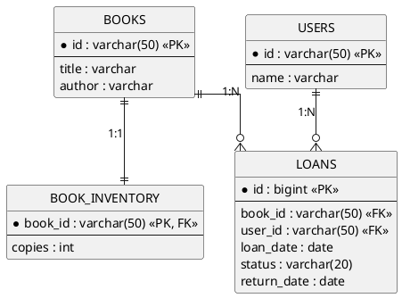

# DOSW Library

Proyecto Spring Boot con soporte para pruebas unitarias con JUnit 5, cobertura con JaCoCo y análisis de calidad con SonarQube.

## DIAGRAMA DE COMPONENTES GENERAL DE LA BIBLIOTECA


## DIAGRAMA DE COMPONENTES ESPECIFICO DE LA BIBLIOTECA


## DIAGRAMA ENTIDAD RELACION (3FN)

Archivo UML (PlantUML): `src/main/resources/uml/EntidadRelacion3FN.puml`


```plantuml
@startuml
hide circle
skinparam linetype ortho

entity "BOOKS" as books {
	*id : varchar(50) <<PK>>
	--
	title : varchar
	author : varchar
}

entity "USERS" as users {
	*id : varchar(50) <<PK>>
	--
	name : varchar
}

entity "BOOK_INVENTORY" as inventory {
	*book_id : varchar(50) <<PK, FK>>
	--
	copies : int
}

entity "LOANS" as loans {
	*id : bigint <<PK>>
	--
	book_id : varchar(50) <<FK>>
	user_id : varchar(50) <<FK>>
	loan_date : date
	status : varchar(20)
	return_date : date
}

books ||--|| inventory : "1:1"
books ||--o{ loans : "1:N"
users ||--o{ loans : "1:N"
@enduml
```

## Requisitos

- Java 21
- Maven 3.9+ o el wrapper incluido en el repositorio
- Docker Desktop (para PostgreSQL y SonarQube)

## Ejecución

Compilar y ejecutar las pruebas:

```bash
./mvnw test
```

En Windows:

```powershell
.\mvnw.cmd test
```

Levantar PostgreSQL y SonarQube:

```powershell
docker compose up -d
```

Ejecutar el reporte de cobertura de JaCoCo:

```bash
./mvnw verify
```

El reporte se genera en `target/site/jacoco/index.html` y el archivo XML para SonarQube en `target/site/jacoco/jacoco.xml`.

## SonarQube

Para analizar el código con SonarQube:

```bash
./mvnw sonar:sonar -Dsonar.host.url=http://localhost:9000 -Dsonar.token=TU_TOKEN
```

## Estructura

- `src/main/java/edu/eci/dosw/tdd/controller`: API REST, DTOs y mappers
- `src/main/java/edu/eci/dosw/tdd/core`: modelo de dominio, servicios, utilidades, validadores y excepciones
- `src/main/java/edu/eci/dosw/tdd/persistence`: capa de persistencia (DAO/Entity, mappers y repositories)
- `src/test/java/edu/eci/dosw/tdd/controller`: pruebas funcionales por operación de controlador
- `src/main/resources/application.yaml`: configuración PostgreSQL/JPA
- `pom.xml`: dependencias y plugins de Maven


Ejecución de funcionalidades de la API

